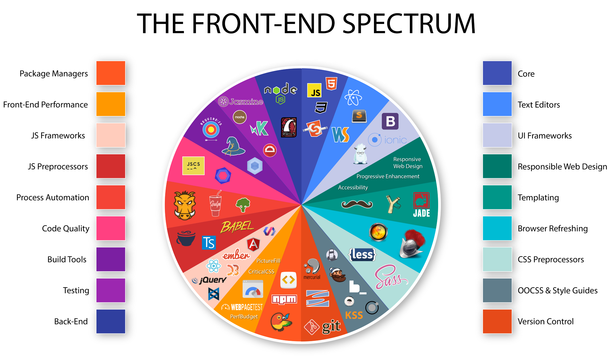

# Full Stack Spectrum

If you are either an associate developer starting your career as a full stack developer or a veteran in this space, you will be overwhelmed to see the amount of tools, processes and terminologies involved in this space.

Because of this over bloated nature in front end space, it creates confusion and feeling of not being good enough to do your job well when someone talks about the huge landscape(a.k.a `Imposter syndrome`).

The motive of this repository is:

- not to bring all the tools or process into picture, but to bring to limelight some of the frequently used upon tools, processes and terminologies to make sure you get comfortable enough and under the understanding that you adopt the growth mindset to learn and be open of any new things which might come in later.
- not to talk about tools which doesn't fit into full stack javascript space.
- not to advertise to use a specific tool or process.



Image credit: [Jeff Pelletier](https://medium.com/@withinsight1/the-front-end-spectrum-c0f30998c9f0)

## I will be using

| Technology | Purpose | Version |
| ---------- | ------- | ------- |
| HTML | Markup language | 5 |
| CSS | Presentation of Markup | 3 |
| JS | dynamic action for Markup | 5 |
| ES2015 | ditto | 6 |
| ES2016 | ditto | 7 |

## Tools of trade

Start by installing the tools mentioned below:

*Note:* Some tools listed below may only available in macOS. I will try to list equivalent tool for windows and linux wherever possible. If not listed find equivalent tool and also raise PR so that i can add it to help others who view this in future.

| Tool | Link | Purpose
|-------|------|-------|
|Hyper|<https://hyper.is/>|Terminal|
|VSCode|<https://code.visualstudio.com>|Code Editor|
|brew|<https://brew.sh/>|Package Manager for macOS|
|homebrew-cask|<https://github.com/Homebrew/homebrew-cask>|Package Manager for macOS apps|
|fish|brew install fish|User friendly interactive shell|
|nodejs|brew install node@8|JavaScript runtime|
|yarn|brew install yarn --without-node|fast dependency manager|
|git|brew install git|Source Control|
|eslint | VSCode extension | Code quality |

## Installing VSCode Extensions and Font

Run install/vscode-extensions.sh

```shell
sh vscode-extensions.sh
```

More on the extensions later.

Install fira code font:

[Fira Code](https://github.com/tonsky/FiraCode)

## Git configuration

Set username in global config:

```shell
git config --global user.name "Your name"
```

As many of us will be working on both personal and official work on same system it is important that the corresponding repositories have appropriate email set. We can create aliases and run the appropriate alias in cloned project. This will set user.email config.

Creating alias:

```shell
alias gitmeHome='git config user.email personal@personal.com`
```

```shell
alias gitmeWork='git config user.email work@work.com`
```

To check if alias is properly set in mac:

```shell
type aliasName
```

Generate ssh keys using:

```shell
ssh-keygen -t rsa -C "your_email@youremail.com"
```

and save in /Users/username/.ssh/ directory. You can generate multiple keys with different names.

To manage multiple accounts, add a file called config under $HOME/.ssh and copy below contents:

```ssh-config
# Personal Github Account:
Host personal
        HostName github.com
        User git
        IdentityFile ~/.ssh/id_rsa
        PreferredAuthentications publickey
        PasswordAuthentication no
        IdentitiesOnly yes

# Work Github Account:
Host work
        HostName github.company.com
        User git
        IdentityFile ~/.ssh/id_rsa_work
        PreferredAuthentications publickey
        PasswordAuthentication no
        IdentitiesOnly yes
```

[Detalied walkthrough here!!](https://everythingsysadmin.com/2017/01/two-github-accounts.html)